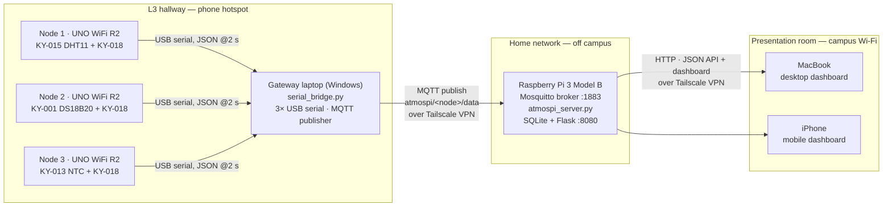
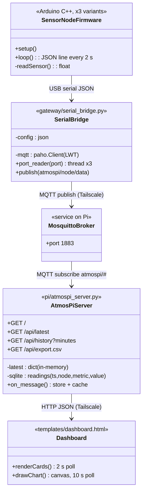

# Documentation for 'AtmosPi'
### Distributed Environmental Monitoring over a VPN-Bridged Wireless Sensor Network for Industrial Safety
Submission date: 03.06.2026
Revised: 04.07.2026

**Advanced Embedded Systems Lab — Summer Term 2026**

**Team:** Group A2 — *AtmosPi*
**Date:** 07.07.2026
**Repository:** <https://github.com/Oluwasholape/SS2026_AES_LAB_GROUP_A2>

> Section authorship is marked with `[author]` at every heading, as required.

---

## Team members `[all]`

| Member | Role in the project |
|---|---|
| Sumon Boiddo | Raspberry Pi platform: OS, Mosquitto broker, Tailscale, service deployment |
| Md Tawhidur Rahman Tuhin | Sensor nodes: wiring, Arduino firmware, gateway bridge operation |
| Oluwasholape Daniel Oyemade | Dashboard: web UI, visualization, REST API integration |
| Nnaemeka Nnachi-Egwu | Project management, integration and testing, system architecture, documentation lead |

---

## Introduction `[Nnaemeka]`

The **Internet of Things (IoT)** describes systems in which physical devices — sensors, actuators and embedded computers — exchange data over networks and make that data available to services and end users. A **Wireless Sensor Network (WSN)** is the sensing layer of such a system: a set of resource-constrained sensor nodes that capture physical phenomena (temperature, humidity, light) and forward their measurements to a central node (sink/gateway), which connects the sensor network to the wider network. In our project domain — **environmental monitoring** — these concepts map directly: constrained 8-bit nodes measure the local atmosphere of a zone, a gateway aggregates the zone data, and an IoT back end stores, processes and visualizes it.

**Target application.** *AtmosPi* is a distributed indoor environment monitor. Three Arduino-based sensor nodes measure temperature, relative humidity and ambient light in three zones. A gateway forwards the readings via **MQTT** to a **Raspberry Pi 3 Model B**, which acts as broker, database and web server. Any authorized device — laptop or smartphone — can open a live, responsive dashboard served by the Pi.

What makes AtmosPi more than a bench demo is its geography: during the final presentation the system deliberately spans **three physically separated locations on three different IP networks** — the Raspberry Pi on a home Wi-Fi network (off campus), the sensor nodes and gateway laptop on a phone hotspot in the L3 hallway, and the dashboard clients on the campus Wi-Fi in the presentation room. The sites are joined into one flat, encrypted overlay network using the **Tailscale VPN (WireGuard)**, demonstrating that the MQTT-based architecture from the lab scales from a table-top setup to a genuinely distributed IoT system without changing a line of application logic.

---

## Concept description `[Nnaemeka]`

### Block diagram of the target application



### Main application of the prototype

Continuous, multi-zone climate monitoring with live remote visualization: current values per zone, comparison of **three temperature-sensing technologies** (digital combo sensor, 1-Wire digital thermometer, analog NTC thermistor) on one chart, per-zone light levels, node online/offline status, historic charts (15 min – 6 h) and CSV export of the complete measurement database.

### Devices, sensors and applications used

| Component | Qty | Function |
|---|---|---|
| Raspberry Pi 3 Model B + microSD | 1 | MQTT broker (Mosquitto), data storage (SQLite), web/API server (Flask) |
| Arduino UNO WiFi Rev2 | 3 | Sensor nodes (one per zone) |
| KY-015 combi sensor (DHT11) | 1 of 3 | Temperature + relative humidity, node 1 |
| KY-001 DS18B20 module | 1 of 3 | Precision digital temperature (1-Wire), node 2 |
| KY-013 NTC module | 1 of 3 | Analog temperature (Steinhart–Hart conversion), node 3 |
| KY-018 photoresistor module | 3 of 5 | Ambient light level, one per node |
| Windows laptop (3× USB) | 1 | WSN gateway/sink: serial-to-MQTT bridge |
| MacBook + iPhone | 2 | Dashboard clients (desktop and mobile layout) |
| Tailscale VPN (free plan) | — | Encrypted overlay network joining all three sites |
| Smartphone WhatsApp video | — | Live remote presentation of the off-site hardware |

*Deviation from the original hardware request:* the team received a Raspberry Pi **3B** instead of a 4, a **DHT11** (KY-015) instead of DHT22, and KY-013/KY-001/KY-018/LM393 modules instead of MQ-135 and BH1750. The architecture is unchanged; the sensor abstraction on the nodes was adapted. The LM393 light module and remaining spare modules are kept as cold spares for the demo. The supplied breadboards are intentionally **not used**: all KY modules carry their required resistors on board, so each sensor connects with three female–female jumpers directly to the Arduino — fewer contacts, fewer failure points.

---

## Project/Team management `[Nnaemeka]`

**Method.** We worked with a lightweight **Scrum/Kanban** hybrid: the semester was split into weekly sprints aligned with the lab sessions; a Kanban board (GitHub Projects: *Backlog → In progress → Review → Done*) tracked tasks; a short weekly stand-up (WhatsApp group + in-lab) synchronized the team. GitHub was used for version control, code review and contribution tracking (as required, individual contributions are visible in the commit history).

**Breakdown.** The system was decomposed along its architecture, which allowed the four members to work in parallel with clean interfaces (the MQTT topic schema and the JSON line format were frozen in sprint 1):

| Work package | Owner | Deliverables |
|---|---|---|
| WP1 Platform & networking | Nnaemeka / Sumon | Pi OS setup (headless, SSH), Mosquitto configuration, Tailscale tailnet incl. onboarding of the gateway laptop, systemd deployment |
| WP2 Sensor nodes & gateway | Nnaemeka / Tuhin | Sensor selection per node, wiring, three Arduino sketches, `serial_bridge.py` operation and COM-port configuration |
| WP3 Visualization | Oluwasholape | Flask REST API consumption, responsive dashboard (desktop + mobile), custom canvas charting, CSV export UI |
| WP4 Architecture & integration | Nnaemeka | End-to-end architecture, topic/payload design, `atmospi_server.py` collector + API, integration tests, documentation, presentation dramaturgy |

**Presentation roles** mirror the work packages: Sumon presents the Pi live from the remote site (WhatsApp video), Tuhin presents the running sensor nodes + gateway from the L3 hallway, Oluwasholape presents the dashboard in the room, Nnaemeka closes with the end-to-end architecture summary; the whole team is present for Q&A.

---

## Technologies `[all — per subsection]`

### Sensors `[Nnaemeka / Tuhin]`

* **KY-015 / DHT11** — combined temperature and humidity sensor with a proprietary single-wire digital protocol; module includes the pull-up resistor. Read via the Adafruit DHT library. Resolution 1 °C / 1 %RH — coarse but delivers two metrics from one part.
* **KY-001 / DS18B20** — digital thermometer on the Dallas **1-Wire** bus, 12-bit resolution (0.0625 °C), ±0.5 °C accuracy; module includes the 4.7 kΩ bus pull-up. Read via OneWire + DallasTemperature libraries.
* **KY-013 / NTC thermistor** — pure analog measurement: the 10 kΩ NTC in a voltage divider is sampled by the Arduino's 10-bit ADC and converted to °C with the **Steinhart–Hart equation** in firmware. Chosen deliberately so the project covers the full sensor-interface spectrum discussed in the lecture: analog + ADC, proprietary digital, and a standardized field bus (1-Wire).
* **KY-018 / LDR photoresistor** — analog light level via voltage divider, one per node, enabling a light comparison across all three zones.

### Communication protocols `[Nnaemeka / Sumon]`

* **USB serial (UART, 9600 baud)** between the nodes and the gateway — line-delimited JSON, one message per node every 2 s.
* **MQTT 3.1.1** (publish/subscribe) between gateway, broker and collector. Topic schema: `atmospi/<node_id>/data` for measurements; `atmospi/gateway/status` as a retained **Last-Will** topic, so the dashboard can show a gateway outage within the keep-alive window. Broker: **Eclipse Mosquitto** on the Pi (as in Lab 05).
* **HTTP/REST + JSON** between the Pi and the dashboard clients (`/api/latest`, `/api/history`, `/api/export.csv`).
* **Tailscale (WireGuard)** as encrypted overlay network. Every participant (Pi, gateway laptop, MacBook, iPhone, monitoring PC) gets a stable 100.x address, reachable across NATs and different physical networks with **no port forwarding and no public exposure of the broker** — the security answer to "your MQTT broker is on the internet?".

### Programming languages and tools `[all]`

* **C/C++ (Arduino)** for the three node firmwares.
* **Python 3** for the gateway bridge (`pyserial`, `paho-mqtt`) and the Pi server (`paho-mqtt`, `Flask`, `sqlite3`).
* **HTML/CSS/JavaScript** for the dashboard — fully self-contained, **zero external libraries/CDNs**; charts are drawn with a hand-written canvas plotter, so the demo works even if the venue blocks third-party traffic. One page serves both form factors via responsive CSS (elaborate desktop grid, condensed mobile layout).
* **SQLite** for persistence, **systemd** for auto-start on boot, **Git/GitHub** for collaboration.

---

## Implementation `[Nnaemeka / Oluwasholape]`

### Static structure



The system is intentionally **stateless at the edges**: nodes only print, the bridge only forwards, and all state (history, node liveness, statistics) lives on the Pi — which is why "the more you implement for visualization on Pi-side" was the guiding principle. Node liveness is derived on the Pi from message recency (10 s window); gateway liveness comes from the MQTT Last Will.

### Use cases

1. **Live monitoring (primary).** A user on the tailnet opens `http://<pi>:8080`. The page shows, per zone: current temperature/humidity/light, sensor type, online status and packet age; a comparison chart of the three temperature technologies; light per zone; humidity history; selectable history window. Desktop and mobile render from the same endpoint.
2. **Outage awareness.** If a node is unplugged, its card turns offline within 10 s; if the gateway loses its network, the broker publishes the Last Will and the "Gateway" hop in the header turns red — demonstrated live in the presentation.
3. **Data export.** Any user downloads the entire measurement history as CSV (`/api/export.csv`) for offline analysis.
4. **Operations.** The team SSHes into the Pi over Tailscale from anywhere for maintenance; `systemd` restarts the collector automatically after power loss.

### Repository structure

```
project/
├── README.md                  ← this documentation (template-conform, MD)
├── arduino/
│   ├── node1_climate/         KY-015 DHT11 + KY-018
│   ├── node2_precision/       KY-001 DS18B20 + KY-018
│   └── node3_analog/          KY-013 NTC + KY-018
├── gateway/
│   ├── serial_bridge.py       serial → MQTT bridge (Windows laptop)
│   ├── config.example.json    broker IP + COM ports
│   └── requirements.txt
├── pi/
│   ├── atmospi_server.py      MQTT collector + SQLite + Flask dashboard/API
│   ├── templates/dashboard.html
│   ├── systemd/atmospi.service
│   └── requirements.txt
└── docs/
    └── SETUP.md               step-by-step deployment + demo-day runbook
```

---

## Results `[Oluwasholape / Tuhin]`

*(Screenshots will be inserted in PDF version of this report)*

* **End-to-end latency:** a sensor value appears on the dashboard ≈ 2–3 s after measurement (2 s sample period + sub-second MQTT/HTTP path over the VPN), measured by covering a KY-018 with a finger and timing the chart response. ``
* **Three-technology temperature comparison:** DHT11, DS18B20 and NTC track each other within ≈ 1–1.5 °C; the DS18B20 shows the smoothest curve (12-bit), the DHT11 quantizes to 1 °C steps, the NTC shows ADC noise reduced by 8-sample averaging — a textbook illustration of sensor trade-offs. ``
* **Cross-network operation:** with the Pi off campus, the gateway on a hotspot and the clients on campus Wi-Fi, the dashboard updated continuously during a 60-minute soak test; no manual reconnection was needed (paho auto-reconnect + Tailscale roaming). ``
* **Failure behaviour:** unplugging node 2 marked it offline after 10 s while the others continued; killing the bridge flipped the gateway hop to offline via MQTT Last Will within the 30 s keep-alive. ``
* **Persistence:** the SQLite database survived a Pi reboot; `systemd` restored broker + server automatically; CSV export returned the full history.

---

## Sources / References `[all]`

1. Project repository (code + this documentation): <https://github.com/Oluwasholape/SS2026_AES_LAB_GROUP_A2/tree/main/project>
2. AES Lab slides SS2026, Prof. Dr.-Ing. A. Hayek: WSN, MQTT Broker Lab (Lab 05), Raspberry Pi Lab, Arduino UNO WiFi Rev2 Lab — HSHL.
3. Eclipse Mosquitto documentation: <https://mosquitto.org/documentation/>
4. MQTT 3.1.1 specification (OASIS): <https://docs.oasis-open.org/mqtt/mqtt/v3.1.1/>
5. Tailscale documentation (WireGuard-based VPN): <https://tailscale.com/kb/>
6. Joy-IT Sensor Kit X-40 datasheet (KY-001, KY-013, KY-015, KY-018): <https://sensorkit.joy-it.net/en/>
7. Adafruit DHT sensor library: <https://github.com/adafruit/DHT-sensor-library>
8. OneWire / DallasTemperature libraries: <https://github.com/PaulStoffregen/OneWire>, <https://github.com/milesburton/Arduino-Temperature-Control-Library>
9. paho-mqtt: <https://eclipse.dev/paho/>; Flask: <https://flask.palletsprojects.com/>; pyserial: <https://pyserial.readthedocs.io/>
10. Steinhart, J. S.; Hart, S. R.: *Calibration curves for thermistors*, Deep-Sea Research, 1968.

---

**AtmosPi — Team A2**
