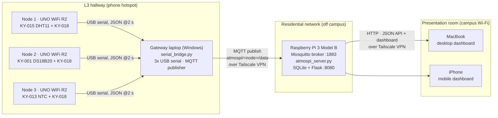
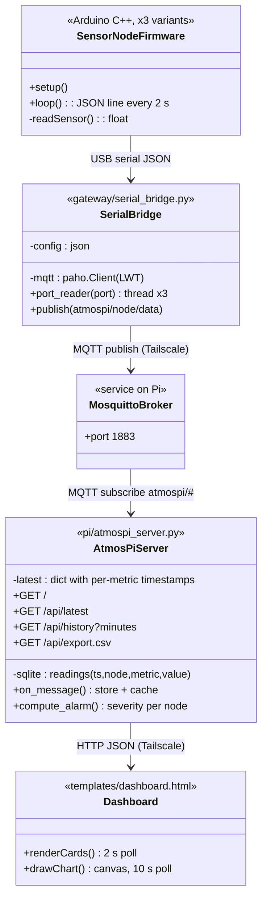

# Documentation for "AtmosPi"
### Distributed Environmental Monitoring over a VPN-Bridged Wireless Sensor Network for Industrial Safety

**Advanced Embedded Systems Lab, Summer Term 2026**

**Team:** Group A2 (AtmosPi)
**Date:** 07.07.2026
**Repository:** <https://github.com/Oluwasholape/SS2026_AES_LAB_GROUP_A2>

> Section authorship is marked with `[author]` at every heading, as required.

---

## Team members `[all]`

| Member | Role in the project |
|---|---|
| Sumon Boiddo | Raspberry Pi platform: OS, Mosquitto broker, Tailscale, service deployment |
| Md Tawhidur Rahman Tuhin | Sensor nodes: wiring, Arduino firmware, gateway bridge operation |
| Oluwasholape Daniel Oyemade | Dashboard: web UI, visualization, REST API integration |
| Nnaemeka Nnachi-Egwu | System architecture, integration and testing, project management, documentation lead |

---

## Introduction `[Nnaemeka]`

The **Internet of Things (IoT)** describes systems in which physical devices, such as sensors, actuators and embedded computers, exchange data over networks and make that data available to services and end users. A **Wireless Sensor Network (WSN)** is the sensing layer of such a system: a set of resource-constrained sensor nodes that capture physical phenomena (temperature, humidity, light) and forward their measurements to a central node (sink/gateway), which connects the sensor network to the wider network. In our project domain, **environmental monitoring for industrial safety**, these concepts map directly: constrained 8-bit nodes measure the local atmosphere of a zone, a gateway aggregates the zone data, and an IoT back end stores, processes and visualizes it.

**Target application.** *AtmosPi* is a distributed environment monitor conceived as a prototype for industrial safety monitoring. In plants, machine halls, server rooms and storage areas, abnormal temperature is one of the earliest indicators of overheating, cooling failure or fire risk, and continuous multi-zone monitoring with remote visibility and failure annunciation is a standard requirement. AtmosPi implements this pattern at lab scale: three Arduino-based sensor nodes measure temperature, relative humidity and ambient light in three zones; a gateway forwards the readings via **MQTT** to a **Raspberry Pi 3 Model B**, which acts as broker, database and web server; any authorized device, laptop or smartphone, can open a live, responsive dashboard served by the Pi.

Three safety-oriented design ideas run through the system. First, **diverse redundancy** on the measurement side: the three zones measure temperature with three fundamentally different technologies (a DHT11 digital combination sensor, a DS18B20 1-Wire digital thermometer, and an analog NTC thermistor read through the ADC), so a systematic fault in one sensing principle can be recognized by cross-checking against the others, analogous to the heterogeneous redundancy used in safety-instrumented systems. Second, **failure detection and annunciation**: node liveness is monitored on the Pi, and a gateway or network outage is announced automatically through the MQTT Last Will mechanism and displayed on the dashboard, so a loss of monitoring is itself a visible, alarmed event rather than a silent gap in the data. Third, **instrument fault detection**: the server tracks the freshness of every individual measurement channel, so a single sensor that stops reporting is flagged as a distinct *sensor fault*, separate from environmental alarms, in the same way industrial control systems distinguish process alarms from instrument faults. This third mechanism was validated against a genuine hardware failure during integration, as described in the Results section.

What makes AtmosPi more than a bench demo is its geography: during the final presentation the system deliberately spans **three physically separated locations on three different IP networks**. The Raspberry Pi runs on a residential Wi-Fi network off campus, the sensor nodes and gateway laptop run on a phone hotspot in the L3 hallway, and the dashboard clients run on the campus Wi-Fi in the presentation room. The sites are joined into one flat, encrypted overlay network using the **Tailscale VPN (WireGuard)**, demonstrating that the MQTT-based architecture from the lab scales from a table-top setup to a genuinely distributed monitoring system without changing a line of application logic.

---

## Concept description `[Nnaemeka]`

### Block diagram of the target application



The dashboard is not confined to the presentation room: because every site is on the same tailnet, it is opened in parallel at all three locations during the demo (on the monitoring PC at the Pi's site and in a browser on the gateway laptop), so each presenter can show the same live system state from their own vantage point.

### Main application of the prototype

Continuous, multi-zone environmental monitoring with live remote visualization: current values per zone, comparison of **three temperature-sensing technologies** on one chart (the diverse-redundancy view), per-zone light levels, node online/offline status, per-channel **sensor fault detection**, gateway outage annunciation, historic charts (15 min to 6 h) and CSV export of the complete measurement database.

### Devices, sensors and applications used

| Component | Qty | Function |
|---|---|---|
| Raspberry Pi 3 Model B + microSD | 1 | MQTT broker (Mosquitto), data storage (SQLite), web/API server (Flask) |
| Arduino UNO WiFi Rev2 | 3 | Sensor nodes (one per zone) |
| KY-015 combi sensor (DHT11) | 1 of 3 | Temperature + relative humidity, node 1 |
| KY-001 DS18B20 module | 1 of 3 | Precision digital temperature (1-Wire), node 2 |
| KY-013 NTC module | 1 of 3 | Analog temperature (Steinhart-Hart conversion), node 3 |
| KY-018 photoresistor module | 3 of 5 | Ambient light level, one per node |
| Windows laptop (3x USB) | 1 | WSN gateway/sink: serial-to-MQTT bridge |
| MacBook + iPhone | 2 | Dashboard clients (desktop and mobile layout) |
| Tailscale VPN (free plan) | - | Encrypted overlay network joining all three sites |
| Smartphone WhatsApp video | - | Live remote presentation of the off-site hardware |

*Deviation from the original hardware request:* the team received a Raspberry Pi **3B** instead of a 4, a **DHT11** (KY-015) instead of DHT22, and KY-013/KY-001/KY-018/LM393 modules instead of MQ-135 and BH1750. The architecture is unchanged; the sensor abstraction on the nodes was adapted. The LM393 light module and remaining spare modules are kept as cold spares. The supplied breadboards are intentionally **not used**: all KY modules carry their required resistors on board, so each sensor connects with three female-female jumpers directly to the Arduino, which means fewer contacts and fewer failure points.

---

## Project/Team management `[Nnaemeka]`

**Method.** We worked with a lightweight **Scrum/Kanban** hybrid: the semester was split into weekly sprints aligned with the lab sessions; a Kanban board (GitHub Projects: *Backlog, In progress, Review, Done*) tracked tasks; a short weekly stand-up (WhatsApp group + in-lab) synchronized the team. GitHub was used for version control, code review and contribution tracking (as required, individual contributions are visible in the commit history).

**Breakdown.** The system was decomposed along its architecture, which allowed the members to work in parallel with clean interfaces (the MQTT topic schema and the JSON line format were frozen in sprint 1). As integration lead, Nnaemeka worked inside WP1, WP2 and WP4 alongside the package owners:

| Work package | Members | Deliverables |
|---|---|---|
| WP1 Platform & networking | Sumon, Nnaemeka | Pi OS setup (headless, SSH), Mosquitto configuration, Tailscale tailnet incl. onboarding of the gateway laptop, systemd deployment |
| WP2 Sensor nodes & gateway | Tuhin, Nnaemeka | Sensor selection per node, wiring, three Arduino sketches, `serial_bridge.py` operation and COM-port configuration |
| WP3 Visualization | Oluwasholape | Flask REST API consumption, responsive dashboard (desktop + mobile), custom canvas charting, CSV export UI |
| WP4 Architecture & integration | Nnaemeka | End-to-end architecture, topic/payload design, `atmospi_server.py` collector + API + alarm logic, integration tests, documentation, presentation dramaturgy |

**Presentation roles** mirror the work packages: Sumon presents the Pi live from the remote site (WhatsApp video, with the dashboard also on screen at his location), Tuhin presents the running sensor nodes + gateway from the L3 hallway (dashboard open on the gateway laptop), Oluwasholape presents the dashboard in the room, Nnaemeka closes with the end-to-end architecture summary; the whole team is present for Q&A.

---

## Technologies `[all, per subsection]`

### Sensors `[Tuhin]`

* **KY-015 / DHT11**: combined temperature and humidity sensor with a proprietary single-wire digital protocol; module includes the pull-up resistor. Read via the Adafruit DHT library. Resolution 1 °C / 1 %RH, coarse but delivering two metrics from one part.
* **KY-001 / DS18B20**: digital thermometer on the Dallas **1-Wire** bus, 12-bit resolution (0.0625 °C), accuracy of about ±0.5 °C; module includes the 4.7 kOhm bus pull-up. Read via OneWire + DallasTemperature libraries. During integration this channel developed a genuine hardware fault (details in Results), which the system now detects and annunciates automatically.
* **KY-013 / NTC thermistor**: pure analog measurement. The 10 kOhm NTC in a voltage divider is sampled by the Arduino's 10-bit ADC and converted to °C with the **Steinhart-Hart equation** in firmware, with 8-sample averaging to reduce ADC noise. Chosen deliberately so the project covers the full sensor-interface spectrum discussed in the lecture (analog + ADC, proprietary digital, standardized field bus) and completes the diverse-redundancy concept for temperature.
* **KY-018 / LDR photoresistor**: analog light level via voltage divider, one per node, enabling a light comparison across all three zones.

### Communication protocols `[Sumon / Nnaemeka]`

* **USB serial (UART, 9600 baud)** between the nodes and the gateway: line-delimited JSON, one message per node every 2 s. Each message self-identifies with a `node` field, so the gateway never depends on which physical COM port a board happens to enumerate on.
* **MQTT 3.1.1** (publish/subscribe) between gateway, broker and collector. Topic schema: `atmospi/<node_id>/data` for measurements; `atmospi/gateway/status` as a retained **Last-Will** topic, so the dashboard can annunciate a gateway outage within the keep-alive window. Broker: **Eclipse Mosquitto** on the Pi (as in Lab 05).
* **HTTP/REST + JSON** between the Pi and the dashboard clients (`/api/latest`, `/api/history`, `/api/export.csv`).
* **Tailscale (WireGuard)** as encrypted overlay network. Every participant (Pi, gateway laptop, MacBook, iPhone, monitoring PC) gets a stable 100.x address, reachable across NATs and different physical networks with **no port forwarding and no public exposure of the broker**. The broker's `allow_anonymous` setting is acceptable in this design precisely because port 1883 is reachable only inside the encrypted tailnet.

### Programming languages and tools `[Oluwasholape / all]`

* **C/C++ (Arduino)** for the three node firmwares.
* **Python 3** for the gateway bridge (`pyserial`, `paho-mqtt`) and the Pi server (`paho-mqtt`, `Flask`, `sqlite3`).
* **HTML/CSS/JavaScript** for the dashboard, fully self-contained with **zero external libraries/CDNs**; charts are drawn with a hand-written canvas plotter, so the demo works even if the venue blocks third-party traffic. The visual design follows the conventions of industrial HMI/SCADA screens: a light control-panel theme, monospaced numeric readouts, and traffic-light colors reserved exclusively for alarm severity so that the alarm language never competes with the chart-line colors. One page serves both form factors via responsive CSS (elaborate desktop grid, condensed mobile layout).
* **SQLite** for persistence, **systemd** for auto-start on boot, **Git/GitHub** for collaboration.

---

## Implementation `[Nnaemeka / Oluwasholape]`

### Static structure



The system is intentionally **stateless at the edges**: nodes only print, the bridge only forwards, and all state (history, node liveness, alarm evaluation, statistics) lives on the Pi, following the lab's guiding principle that the more is implemented for visualization on the Pi side, the better. Node liveness is derived on the Pi from message recency (10 s window); gateway liveness comes from the MQTT Last Will.

### Alarm logic

All alarm evaluation runs on the Raspberry Pi, inside `atmospi_server.py`; the browser only renders the result. Two independent alarm classes are computed, mirroring the distinction industrial control systems make between *process alarms* and *instrument faults*:

**Process alarms (environmental severity).** Every incoming reading is checked against per-metric thresholds and the node is assigned the worst applicable level:

| Metric | Warning | Critical |
|---|---|---|
| Temperature | >= 27 °C or <= 12 °C | >= 32 °C or <= 8 °C |
| Humidity | >= 65 % or <= 25 % | >= 80 % or <= 15 % |
| Light level | <= 25 % | <= 10 % |

The bands are deliberately reachable in a live demonstration (warming a sensor by hand, covering a photoresistor) while still reading as a plausible monitoring policy: out-of-range temperature or humidity indicates an HVAC or process fault, and loss of illumination is a safety hazard in a monitored work zone.

**Instrument faults (sensor supervision).** The server stores a timestamp per node *and per measurement channel*. Each node declares which metrics it is expected to produce; if a node is alive (its other channels are updating) but one expected channel has not been refreshed within the liveness window, that channel is reported as a **sensor fault**: the affected node can never display as "normal", a dedicated indigo fault badge appears on its card together with the name of the missing quantity, and a separate fault counter is shown in the dashboard header, apart from the normal/warning/critical/offline counts. A blind spot in monitoring is thereby treated as more alarming than a borderline reading, not less. The flag clears automatically as soon as the channel reports again.

**Outage annunciation.** A node that stops reporting entirely is marked offline within 10 s. If the gateway loses its network or crashes, the broker publishes the retained Last-Will message and the gateway hop in the dashboard header turns red within the MQTT keep-alive window.

### Use cases

1. **Live monitoring (primary).** A user on the tailnet opens `http://100.85.200.42:8080`. The page shows, per zone: current temperature/humidity/light, sensor type, online status, alarm severity and packet age; a comparison chart of the three temperature technologies; light per zone; humidity history; selectable history window. Desktop and mobile render from the same endpoint, and the same URL is displayed simultaneously at all three demo sites.
2. **Instrument fault supervision.** If a single sensor stops delivering while its node stays alive, the dashboard flags the exact missing quantity on the affected node's card and raises the header fault counter. In an industrial context this corresponds to the requirement that a failed instrument must be annunciated even while the process itself is healthy.
3. **Outage awareness.** If a node is unplugged, its card turns offline within 10 s; if the gateway loses its network, the Last Will turns the gateway hop red. Loss of monitoring is annunciated, never silent.
4. **Data export.** Any user downloads the entire measurement history as CSV (`/api/export.csv`) for offline analysis.
5. **Operations.** The team administers the Pi over Tailscale SSH from anywhere; `systemd` restarts the broker and collector automatically after power loss, which was verified with a reboot test during deployment.

### Repository structure

```
project/
├── README.md                  <- this documentation
├── arduino/
│   ├── node1_climate/         KY-015 DHT11 + KY-018
│   ├── node2_precision/       KY-001 DS18B20 + KY-018
│   └── node3_analog/          KY-013 NTC + KY-018
├── gateway/
│   ├── serial_bridge.py       serial -> MQTT bridge (Windows laptop)
│   ├── config.json            broker IP + COM ports (deployed values)
│   ├── config.example.json    template
│   └── requirements.txt
└── pi/
    ├── atmospi_server.py      MQTT collector + alarm logic + Flask dashboard/API
    ├── templates/dashboard.html
    ├── systemd/atmospi.service
    └── requirements.txt
```

---

## Results `[Oluwasholape / Tuhin]`

* **End-to-end latency.** A sensor value appears on the dashboard about 2 to 3 s after measurement (2 s sample period plus a sub-second MQTT/HTTP path over the VPN), verified by covering a KY-018 with a hand and watching the corresponding card and chart react in the presentation room while the sensor sat in the hallway.
* **Cross-network operation.** With the Pi off campus on a residential network, the gateway on a phone hotspot and the clients on campus Wi-Fi, the dashboard updated continuously; reconnection after transient network events was automatic (paho auto-reconnect plus Tailscale roaming), with no manual intervention required at any site.
* **Three-technology temperature comparison (diverse redundancy).** The DHT11 and the NTC channel track each other within a few °C. The DS18B20 delivers the smoothest curve when operating (12-bit resolution), the DHT11 quantizes to 1 °C steps, and the NTC shows residual ADC noise despite 8-sample averaging. The comparison chart makes an implausible or drifting sensor immediately visible against its two siblings, which is the practical payoff of heterogeneous redundancy.
* **Instrument fault detection, validated against a real fault.** During system integration, the KY-001 DS18B20 channel on node 2 failed: the node continued reporting light levels normally while temperature stopped arriving. Diagnosis (two different sensor modules, multiple jumper sets and ground pins were tried) isolated the fault to a marginal contact at the board's header socket. Rather than masking the fault, the team extended the server with per-channel freshness supervision, and the failed channel became a live demonstration: the dashboard shows node 2 with a dedicated *sensor fault* badge naming the missing quantity, while the node's remaining channel and both other nodes continue to report. The original design goal of reading temperature across all three nodes was thus converted into a demonstration of exactly the failure mode that supervision exists to catch.
* **Outage behaviour.** Unplugging a node marks it offline within 10 s while the others continue; stopping the gateway bridge flips the gateway hop to offline through the retained MQTT Last Will within the keep-alive window. Both behaviours are demonstrated live in the presentation.
* **Persistence and unattended operation.** The SQLite database survives Pi reboots; a deliberate reboot test confirmed that `systemd` restores Mosquitto and the AtmosPi server automatically with no operator action, after which the dashboard recovered on its own. This property is what allows the Pi to run unattended at a remote site for the entire presentation. CSV export returns the complete measurement history.

---

## Sources / References `[all]`

1. Project repository (code + this documentation): <https://github.com/Oluwasholape/SS2026_AES_LAB_GROUP_A2/tree/main/project>
2. AES Lab slides SS2026, Prof. Dr.-Ing. A. Hayek: WSN, MQTT Broker Lab (Lab 05), Raspberry Pi Lab, Arduino UNO WiFi Rev2 Lab, HSHL.
3. Eclipse Mosquitto documentation: <https://mosquitto.org/documentation/>
4. MQTT 3.1.1 specification (OASIS): <https://docs.oasis-open.org/mqtt/mqtt/v3.1.1/>
5. Tailscale documentation (WireGuard-based VPN): <https://tailscale.com/kb/>
6. Joy-IT Sensor Kit X-40 datasheet (KY-001, KY-013, KY-015, KY-018): <https://sensorkit.joy-it.net/en/>
7. Adafruit DHT sensor library: <https://github.com/adafruit/DHT-sensor-library>
8. OneWire / DallasTemperature libraries: <https://github.com/PaulStoffregen/OneWire>, <https://github.com/milesburton/Arduino-Temperature-Control-Library>
9. paho-mqtt: <https://eclipse.dev/paho/>; Flask: <https://flask.palletsprojects.com/>; pyserial: <https://pyserial.readthedocs.io/>
10. Steinhart, J. S.; Hart, S. R.: *Calibration curves for thermistors*, Deep-Sea Research, 1968.

---

**Team AtmosPi (Group A2)**
