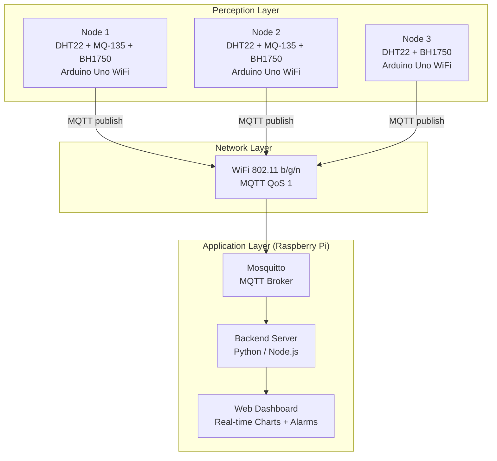
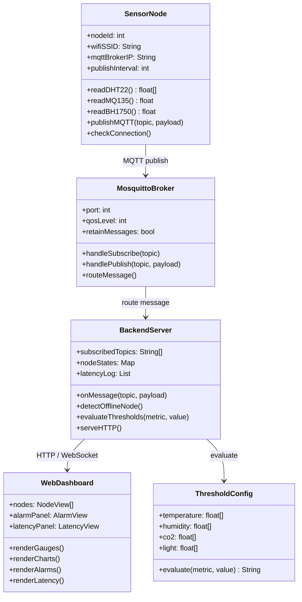

# Documentation for 'AtmosPi'
### A Real-Time WSN (Wireless Sensor Network) for Industrial Environmental Safety
Submission date: 03.06.2026

---

## Team Members
- Boiddo, Sumon
- Nnachi-Egwu, Nnaemeka
- Oyemade, Oluwasholape Daniel
- Tuhin, Md Tawhidur Rahman

---

## Introduction

The Internet of Things (IoT) refers to the interconnection of physical devices that collect, exchange, and act on data through communication networks. In an industrial context, IoT enables continuous monitoring of environmental parameters such as temperature, humidity, air quality, and ambient light across distributed locations, providing actionable insight into conditions that affect worker safety and equipment reliability.

Wireless Sensor Networks (WSN) extend this concept by deploying multiple low-power sensor nodes that communicate wirelessly and collaboratively, forming a mesh of perception across a physical space. In this project, each sensor node operates independently but contributes data to a central hub, establishing a WSN topology directly applicable to smart factory and process control environments.

AtmosPi is a prototype industrial environmental safety monitoring system. Three Arduino Uno WiFi sensor nodes continuously measure environmental parameters and publish readings over MQTT to a Raspberry Pi acting as a safety gateway. The Pi aggregates all data and serves a real-time web dashboard with threshold-based alarm states, node health indicators, and MQTT latency tracking, demonstrating the core principles of reliable, deterministic industrial communication.

---

## Concept Description

### Target Application

AtmosPi simulates a safety monitoring deployment for an indoor industrial environment such as a production floor, laboratory, or server room, where continuous awareness of air quality, temperature, humidity, and lighting conditions is required for both personnel safety and equipment protection.

The system follows a three-tier architecture:

- **Perception layer:** Arduino Uno WiFi nodes with DHT22, MQ-135, and BH1750 sensors
- **Network layer:** WiFi-based MQTT messaging with configurable QoS levels
- **Application layer:** Raspberry Pi running Mosquitto broker, a backend server, and a real-time web dashboard

### Block Diagram

### Devices, Sensors and Actuators

| Item | Qty | Role / Notes |
|---|---|---|
| Raspberry Pi 4 (2 GB+) | 1 | MQTT broker (Mosquitto), web server, dashboard host |
| Arduino Uno WiFi Rev2 | 3 | Sensor nodes, one per monitoring zone |
| DHT22 | 3 | Temperature (°C) and relative humidity (%), one per node |
| MQ-135 | 2 | Air quality / CO2 / VOC levels, nodes 1 and 2 |
| BH1750 | 3 | Ambient light level (lux) over I2C, one per node |
| MicroSD Card (32 GB) | 1 | Raspberry Pi OS and data persistence |
| Half-size Breadboard | 3 | Per-node prototyping |
| Jumper wires and resistors | | 10 kOhm pull-ups for DHT22, general wiring |

---

## Project / Team Management

### Project Method

The team adopted an iterative, milestone-driven approach aligned with the course schedule. Weekly lab sessions served as sprint reviews, with tasks distributed and tracked via this GitHub repository. The following milestones structured the project:

- **Week 1:** Team formation, topic selection, hardware request
- **Week 2:** Environment setup: Arduino IDE, Raspberry Pi OS, Mosquitto
- **Week 3:** Sensor node firmware development and MQTT publishing
- **Week 4:** Raspberry Pi backend and dashboard frontend development
- **Week 5:** Integration testing, threshold calibration, latency logging
- **Week 6:** Documentation, final presentation preparation

### Task Breakdown and Roles

| Team Member | Role | Responsibilities |
|---|---|---|
|  | Firmware Lead | Arduino sensor firmware, MQTT publishing, BH1750/DHT22/MQ-135 integration |
|  | Backend Lead | Raspberry Pi setup, Mosquitto config, Python/Node.js backend server |
|  | Frontend Lead | Web dashboard design and implementation, real-time charts, alarm UI |
|  | Integration and Docs | System integration testing, latency logging, documentation, presentation |

---

## Technologies

### Sensors and Interfaces

- **DHT22:** digital temperature and humidity sensor, single-wire protocol, +/-0.5 degrees C accuracy
- **MQ-135:** analog air quality sensor, detects CO2, NH3, benzene, and other VOCs, requires 24 h warm-up for stable baseline
- **BH1750:** digital ambient light sensor, I2C interface, 1 to 65535 lux range, direct lux output with no ADC needed

### Communication Protocols

- **WiFi (802.11 b/g/n):** transport layer between Arduino nodes and Raspberry Pi
- **MQTT (Message Queuing Telemetry Transport):** lightweight pub/sub protocol, Mosquitto broker on Raspberry Pi, QoS Level 1 used for sensor data to guarantee at-least-once delivery
- **HTTP / WebSocket:** dashboard served over HTTP, real-time updates via WebSocket or polling

### Programming Languages and Frameworks

- **C++ (Arduino IDE):** sensor node firmware
- **Python or Node.js:** Raspberry Pi backend / MQTT subscriber
- **HTML, CSS, JavaScript:** web dashboard frontend
- **Chart.js:** real-time data visualization

---

## Implementation

### System Architecture

Each Arduino Uno WiFi node connects to the local WiFi network and publishes sensor readings to topic paths of the form `atmospi/node{id}/{metric}` (e.g. `atmospi/node1/temperature`) at a configurable interval (default: 5 seconds). The Raspberry Pi runs a Mosquitto MQTT broker, a backend process that subscribes to all topics and maintains an in-memory state, and an HTTP server that exposes the dashboard.

The dashboard polls or subscribes to the backend and renders per-node gauges, time-series charts, alarm badges, and a latency panel. If a node misses three consecutive publish cycles, its status is marked offline and an alert is raised on the dashboard.

### Module Diagram

### Safety Threshold Configuration

| Parameter | Warning Threshold | Critical Threshold | Reference |
|---|---|---|---|
| Temperature | > 30 degrees C | > 40 degrees C | OSHA / EN 13779 |
| Humidity | < 20% or > 70% | < 10% or > 85% | ISO 7730 |
| CO2 (MQ-135) | > 1000 ppm | > 2000 ppm | ASHRAE 62.1 |
| Light Level | < 100 lux | < 50 lux | EN 12464-1 |

---

## Results

*To be completed after implementation. Will include screenshots of the dashboard, graphs of sensor data over time, observed MQTT latency figures, and any alarm state triggers captured during testing.*

---

## Sources / References

- Arduino Documentation: Arduino Uno WiFi Rev2 — https://docs.arduino.cc/hardware/uno-wifi-rev2
- Eclipse Mosquitto MQTT Broker — https://mosquitto.org
- DHT22 Datasheet: Aosong Electronics
- MQ-135 Datasheet: Zhengzhou Winsen Electronics
- BH1750 Datasheet: ROHM Semiconductor
- OSHA Technical Manual: Heat Stress — https://www.osha.gov
- ASHRAE Standard 62.1: Ventilation for Acceptable Indoor Air Quality
- EN 12464-1: Light and Lighting of Work Places
